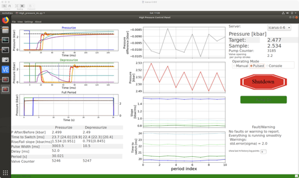

==================
Application Level
==================

The main application graphical user interface (GUI) is divided into three main sections (columns).

The left column shows three graphs and table. The graphs are from the previous full cycle: top: pressurization, middle: depressurization and bottom: full period. The table shows the analysis of the full period.

The middle column shows the logged history and consists of four graphs(from top to bottom): (i) Pressure difference between end of pressurization and just before depressurization; (ii) Pressure after the pressurization; (iii) slope of the pressurization blue and depressurization green; (iv) time to switch between when the signal to switch was sent and actual pressure change occurred. blue - pressurization and green - depressurization; with light shade corresponding to approximated values at the sample.

the right column, from top to bottom:

* server selector
* Pressure in kbar for Target and sample
* pulse counter and number of pulses per pump stroke
* three different operation modes: manual, pulsed and console_counter
* the emergency shut down button
* pump on/off button
* two buttons for manual pressurization and depressurization
* message field for faults and warnings
