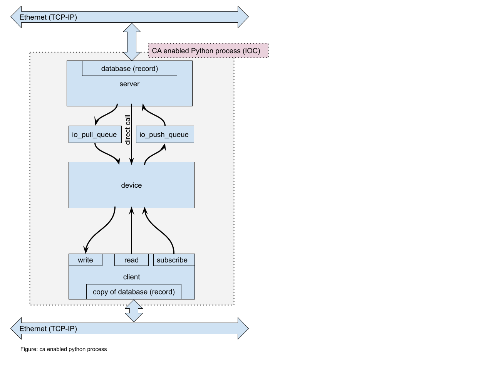

==============================
Channel Access Caproto Server
==============================

*****************
Overview
*****************

The goal of channel access (CA) is to provide remote access to records and fields(PV database) managed by a server(IOC), including search and discovery of hosts and minimal flow control.

The figure “ca enabled python process” shows an inner diagram of a single Channel Access enabled process which consists of three major modules: server, device, and client. A server is responsible for keeping(hosting) a database(record) of all process variables(PVs) and responsible for updating all subscribed clients if there are any changes in the database. A client provides a pathway to interact with other servers on the network. The client provides write and read functionality that allows writing into(or reading from) a remote PV, and can subscribe to PV updates. If a client is subscribed to PV updates, it will trigger immediate execution of a callback function when an update arrives.

The heart of the CA enabled process is in the device module, which contains all necessary functionality: data processing thread, data acquisition thread with a circular buffer, etc. If there is a new update to the database on the server side, a function in the device module can be directly called, if such action is permitted, or new updates to the database can be put into the pull queue and the device examines it when an opportunity arises. The device module can submit new values to the push queue (io_push_queue) which promptly updates the database(record) on the server side and prompt updates of subscribed clients will follow.

*****************
Code structure
*****************

The 'class Server(PVGroup)', a caproto class, starts with definition of various process variable the server is hosting.

.. code-block:: python

  dio = pvproperty(value=0)

Then the class supports a series of different decorators and corresponding functions that are launched at a different times.

The first one is a startup decorator. This function will be executed upon initialization at the startup of the python process. See example below.

.. code-block:: python

  @dio.startup
  async def dio(self, instance, async_lib):
    """
    function body goes here
    """

The next two decorator are putter and getter. These function are executed when the value of the process variable is updated(putter) or read(getter) from the ca server database.  Note, that putter has an extra variable as an input, which is 'value'. You can examine the new PV value and act accordingly.

.. code-block:: python

    @dio.putter
    async def dio(self, instance, value):
      """"""

    @dio.getter
    async def dio(self, instance):

upon the startup of the very first PV, the initialization of the asynchronous thread safe queue is done.
